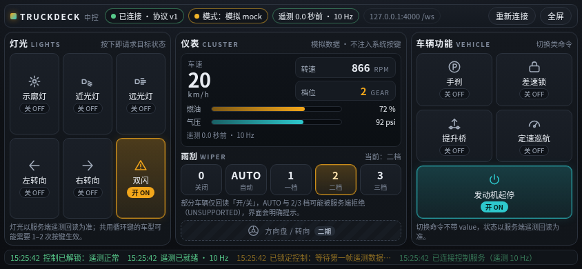

# TruckDeck

局域网电脑上的 Node 服务 + 手机浏览器横屏中控，用于 **Euro Truck Simulator 2 / American Truck Simulator**。  
默认端口 **4000**，WebSocket 路径 **`/ws`**。仅私网使用，不提供公网隧道。



`npm test` **26/26** · 端到端复验 **18/18**（默认端口与非默认端口各一轮）· 契约 **v1 已冻结** · **Windows 实机注入待验收**

## 它做什么

- 电脑跑一个 Node 服务（Express + `ws`）：把游戏遥测推给手机，把手机上的按钮点按变成游戏按键。
- 手机打开即是横屏深色中控：16 个控制按钮，状态**以后续遥测回显为准**，不把“命令已发送”当成“游戏已切换”。
- 游戏/插件不存在时自动进入 **mock**：面板全功能可演示，且**绝不**向操作系统注入按键。
- 只服务局域网：私网来源校验 + WebSocket Origin 校验，避免任意网页跨站触发键盘注入。

## 一期功能

| 分区 | 按钮 | 行为 |
| --- | --- | --- |
| 灯语 | 示廓、近光、远光、左转向、右转向、双闪 | 带 `boolean` 目标状态；示廓与近光默认共用 `L` 键，服务端按当前遥测算循环步数 |
| 雨刮 | `0` / `AUTO` / `1` / `2` / `3` | mock 全五档可用；真实源 SDK 只能回读开/关，不伪造档位 |
| 车辆 | 手刹、差速锁、提升桥、定速、发动机起停 | `toggle`；无键位映射时返回 `UNSUPPORTED`，不假装成功 |

二期（vJoy 陀螺仪方向盘）只留接口与 TODO，一期不实现：见 [`docs/PHASE2_VJOY.md`](docs/PHASE2_VJOY.md)。

---

## 环境要求

- **Node.js ≥ 22**（推荐 **24**；与 `trucksim-telemetry@1.0.0` engines 对齐）
- Windows PC 运行游戏与真实遥测/按键；Linux 可跑服务与 **全功能 mock**（演示足够）。**Windows 实体机 / 游戏尚未验收**（含 SendInput 与共享内存实机）。

安装 Node（示例）：

- 官网：https://nodejs.org/（选 22 LTS 或 24）
- 或包管理器：`winget install OpenJS.NodeJS.LTS`（Windows）

---

## 快速开始

```bash
cd TruckDeck
npm install
npm run build    # 将 web/ 复制到 server/public/；无前端时生成极简状态页
npm start        # 自动先 build，再启动
```

强制 mock：

```bash
# Windows PowerShell
$env:TRUCKDECK_MOCK="1"; npm start

# bash
TRUCKDECK_MOCK=1 npm start
```

自定义端口：

```bash
TRUCKDECK_PORT=4000 npm start
```

健康检查：打开 `http://127.0.0.1:4000/health`，模拟模式返回 `{"ok":true,"mock":true}`，真实模式返回 `{"ok":true,"mock":false}`。

---

## 手机连接

1. 电脑与手机同一局域网。
2. Windows 上 `ipconfig`，找到以太网/WLAN 的 **IPv4**。
3. 手机浏览器打开：`http://<电脑局域网IP>:4000`（替换尖括号内的内容，横屏）。
4. 前端必须用 `location.host` 连接 `ws://` + 当前主机端口 + `/ws`，不要写死 IP。

### Windows 防火墙

将网络配置为**专用网络**，并允许 Node 入站 TCP **4000**（首次运行 Windows 可能弹窗）。公共网络下可能被拦。

---

## scs-sdk-plugin（真实遥测）

**来源：** [RenCloud/scs-sdk-plugin](https://github.com/RenCloud/scs-sdk-plugin)  
**Node 桥：** [trucksim-telemetry](https://www.npmjs.com/package/trucksim-telemetry)（维护者文档当前支持插件 **v1.12.1**；API：`getData()`）  
**共享内存名：** `Local\SCSTelemetry`（插件 README）

### 安装路径

将插件 DLL 放到游戏目录：

- ETS2：`<Steam>/steamapps/common/Euro Truck Simulator 2/bin/win_x64/plugins/`
- ATS：`<Steam>/steamapps/common/American Truck Simulator/bin/win_x64/plugins/`

若无 `plugins` 文件夹则新建。启动游戏时应提示 SDK 已激活。

### 字段单位（一手文档，非猜测）

| 契约字段 | SDK / trucksim-telemetry | 换算 |
| --- | --- | --- |
| `speedKmh` | `speed`（m/s） | × 3.6 |
| `engineRpm` | `engineRpm` | 原样 |
| `gear` | `gearDashboard` 优先，否则 `gear` | 原样 |
| `fuelPct` | `fuel` / `fuelCapacity`（升） | 百分比 |
| `airPressure` | `airPressure` | **psi** |
| 灯光等 | `lightsParking` 等 boolean | 原样 |
| `wipers` | SDK **仅 boolean** | live 只回显 `off` / `1`（on）；**不伪造** `2`/`3`/`auto` |

**模式：** 插件不可用、共享内存无 `sdkActive`、非 Windows、或 `TRUCKDECK_MOCK=1` → mock。仅“Node 包装得上”不够；游戏未开也会 mock。模式变化会再推 hello ack 的 `mock` 字段。

### Windows 安装 / 重建 trucksim-telemetry 原生桥

1. 安装 [Visual Studio Build Tools](https://visualstudio.microsoft.com/visual-cpp-build-tools/) 的 **Desktop development with C++**。
2. `npm install`（`trucksim-telemetry` 为 optionalDependency）。
3. 若 npm 提示 **allow-scripts** 阻止了该包的 `node-gyp rebuild`，**只批准这一包**，不要关掉全部脚本限制，例如：
   ```bash
   npm approve-scripts trucksim-telemetry
   npm rebuild trucksim-telemetry
   ```
4. 重建失败时服务仍可 mock 启动；装好插件并启动游戏后才会 live。

> **Windows 实体机 / 游戏尚未验收。** Linux CI 仅覆盖 mock 与协议 worker。

---

## 按键注入（Windows）

- 实现：`server/src/input/sendinput_worker.ps1`（`-File` 启动）+ **SendInput**；stdin 仅 JSON 行（数字 VK）；含正确 INPUT union、返回值检查、扫描码 / `KEYEVENTF_EXTENDEDKEY`（见 Microsoft INPUT / SendInput / KEYBDINPUT 文档）。
- **mock / 断线绝不注入。** 命令全进程串行有界队列。
- 游戏窗口需前台焦点；`dispose` 先 `quit` 等待 worker 释放按键，再必要时 kill。
- Node/PowerShell 与游戏应处于相同权限级别。游戏若以管理员身份运行，普通权限的 SendInput 可能被 Windows UIPI 拒绝；优先让游戏和服务都以普通权限运行。
- 修改映射：`config/keybinds.default.json`，须与游戏内一致且在白名单内。

### 灯光 / 雨刮真实性限制

- 默认 `lights.parking` 与 `lights.beamLow` 同为 **L**：按 `off→parking→low→off` 循环，依遥测算步数；同状态 no-op。**关 parking 会连带关掉 low。**
- live 雨刮：SDK 只能区分 off/on；默认 `wipers.auto` 未映射 → **`UNSUPPORTED`**；`2`/`3` 无独立键位时同样拒绝，不假装成功。
- **mock** 仍可使用 `off|auto|1|2|3` 全五档。

---

## Mock ↔ 真实

| 条件 | 模式 |
| --- | --- |
| `TRUCKDECK_MOCK=1` | 强制 mock |
| Linux / 无原生桥 | mock |
| Windows + 桥可用但游戏未连（无 sdkActive） | mock |
| Windows + sdkActive + 未强制 mock | live |

Mock 下有效 command 会改模拟仪表并打 `[mock]` 日志。

---

## 架构与目录

```
TruckDeck/
├── server/                 # Node 服务：HTTP + WebSocket + 遥测 + 按键
│   ├── index.js            # 入口：装配 config/telemetry/input/wsHub，SIGINT/SIGTERM 优雅停机
│   ├── src/app.js          # Express：/health、静态托管、局域网与 Origin 校验
│   ├── src/wsHub.js        # /ws 升级、hello 握手、遥测广播、命令分发与速率限制
│   ├── src/telemetry/      # scs-sdk-plugin（trucksim-telemetry）与 mock 两套实现，自动切换
│   ├── src/input/          # Windows PowerShell SendInput worker（Linux 下为协议替身）
│   ├── src/commands/       # 命令校验、有界串行队列、灯光循环规划
│   ├── src/lan.js          # 私网来源与本机 Host / Origin 判定
│   └── scripts/build.js    # web/ → server/public/（缺前端时写入极简状态页）
├── web/                    # 手机端中控（原生 HTML/CSS/JS，无 CDN；构建产物由 server 托管）
├── config/                 # keybinds.default.json（键位白名单）、server.default.json
├── test/                   # node --test：协议 / 队列 / 模式 / 状态页回归（不依赖构建产物）
└── docs/                   # 冻结契约、架构、二期、验收记录与证据
```

数据流：`游戏 ↔ scs-sdk-plugin 共享内存 → telemetry → wsHub 广播 → 手机`，`手机 command → 校验 → 有界串行队列 → input（注入或 mock）→ 遥测回显`。
模式切换（mock ↔ live）会推进代次，旧模式下积压的命令直接作废，避免误注入。

## 协议速览

```json
// 手机 → 服务：必须先握手
{"type":"hello","role":"web","version":"1"}
// 服务 → 手机：握手确认（mock 状态与推送频率）
{"type":"hello","ok":true,"role":"server","version":"1","mock":true,"telemetryHz":10,"ts":1710000000000}

// 服务 → 手机：遥测（契约下限 ≥5Hz，默认 10Hz）
{"type":"telemetry","ts":1710000000000,"data":{"connected":true,"speedKmh":0,"engineRpm":0,"gear":0,
 "fuelPct":0,"airPressure":0,"lights":{"parking":false,"beamLow":false,"beamHigh":false,
 "blinkerLeft":false,"blinkerRight":false,"hazard":false},"wipers":"off","handbrake":false,
 "diffLock":false,"liftAxle":false,"cruise":false,"engineOn":false}}

// 手机 → 服务：命令（12 类 action；可选 id 原样回传）
{"type":"command","id":"c1","action":"lights.beamLow","value":true}
// 服务 → 手机：确认 / 拒绝（HELLO_REQUIRED、INVALID_VALUE、UNKNOWN_ACTION、UNSUPPORTED…）
{"type":"command_ack","ok":true,"action":"lights.beamLow","id":"c1","ts":1710000000000}
```

完整字段、单位、错误枚举与安全要求见 [`docs/API_CONTRACT.md`](docs/API_CONTRACT.md)。

## 开发与测试

```bash
npm test                                  # 26 项：协议、队列、模式切换、状态页（默认占 4011，不动 4000）
npm start &                               # 启动后做端到端复验（HTTP + WS）
node docs/acceptance/verify-ws.cjs 4000   # 18 项：含 Origin/Host 拒绝、HELLO_REQUIRED、8KiB 帧上限等
```

测试**不依赖构建产物**，全新克隆可直接 `npm ci && npm test`；脚本 stdout 为 JSON、stderr 为 `PASS/FAIL` 日志。
编辑 `web/` 后运行 `npm run build` 并刷新手机即可；改后端或 JSON 配置需重启服务。实际验证结果见 [`docs/ACCEPTANCE.md`](docs/ACCEPTANCE.md)。

### 重启服务

在运行服务的终端按 Ctrl+C，完成修改后重新启动：

```bash
cd TruckDeck
npm start
```

测试始终使用独立端口：`TRUCKDECK_TEST_PORT=4011 npm test`。

Windows 上退出强制模拟：PowerShell 执行 `Remove-Item Env:TRUCKDECK_MOCK -ErrorAction SilentlyContinue`，然后 `npm start`。

---

## 已知限制

- **Windows 实体机 / 游戏尚未验收**（SendInput / 共享内存）。Linux 上全功能 mock 可演示；另有协议 worker 测。
- SDK 雨刮仅为开关；live 不伪造多档/AUTO。
- 提供 manifest 与本地图标，可通过浏览器菜单添加主屏幕快捷方式；局域网 HTTP 下安装、全屏、方向锁定能力依浏览器而定。无 Service Worker，不支持离线控制。
- 灯光循环与个别车型可能不完全一致。
- 不做公网访问、账号、云同步。
- 二期 vJoy：[`docs/PHASE2_VJOY.md`](docs/PHASE2_VJOY.md)。

---

## 故障排除

| 现象 | 处理 |
| --- | --- |
| 手机打不开页面 | IP、防火墙专用网络、端口 4000、同网段 |
| 一直 mock | 游戏是否运行、插件路径、`sdkActive`、是否 `TRUCKDECK_MOCK`、原生桥是否 rebuild 成功 |
| 按键无反应 | 焦点、键位、是否 mock/断线 |
| WS 立刻断开 | Origin 必须与本机 Host 一致（localhost 或 PC LAN IP） |

---

## 验收与实现出处

一期由「编排放 + 两个实现代理」完成，并保留可复核证据：契约由 Cursor Agent 实现并冻结，手机面板由 Cline Agent 实现，接口对齐、返修指派与独立验收由编排放完成；`docs/acceptance/` 存放截图、原始输出、派单与回传原文、以及两个代理的真实运行日志（已扫描确认无凭据）。

- `npm test` **26/26**（协议、队列、模式切换、状态页回归）
- 端到端复验 **18/18**：默认端口 4000 与非默认端口 4013 各一轮；12 类 action、22 次操作全部 ack 且与后续遥测一致；实测遥测 9.33 / 9.98 Hz
- 安全拒绝路径：外域 / `null` / 端口不符 Origin、非本机 Host、非 `/ws` 路径、未握手命令、非法 JSON 与非法 value、超过 8 KiB 单帧
- 复现步骤与证据清单：[`docs/acceptance/README.md`](docs/acceptance/README.md)

## 文档

- [`docs/API_CONTRACT.md`](docs/API_CONTRACT.md) — 冻结契约 v1：端点、消息、action 枚举、单位、错误码、安全要求
- [`docs/ARCHITECTURE.md`](docs/ARCHITECTURE.md) — 模块划分与启动流程
- [`docs/INTEGRATION_PATCH.md`](docs/INTEGRATION_PATCH.md) — 前后端对接的行为澄清与修正
- [`docs/ACCEPTANCE.md`](docs/ACCEPTANCE.md) — 验收记录：分工、实测数据、已知限制
- [`docs/acceptance/README.md`](docs/acceptance/README.md) — 证据目录、复现命令、代理日志说明
- [`docs/PHASE2_VJOY.md`](docs/PHASE2_VJOY.md) — 二期 vJoy / 陀螺仪接口草稿

## 许可

[MIT](LICENSE) © 2026 sakuradairong
